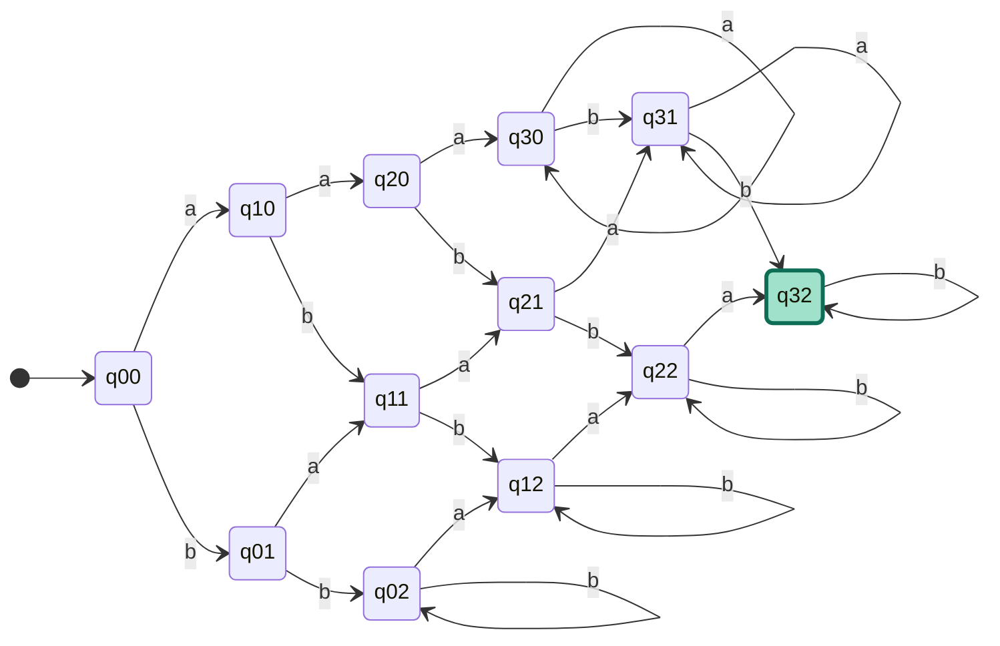
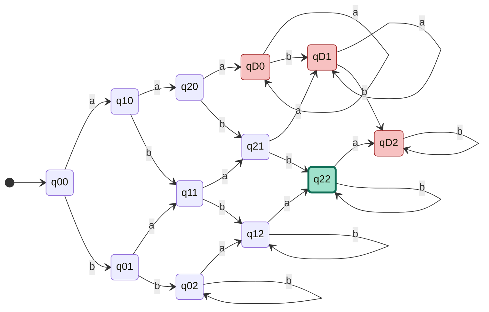
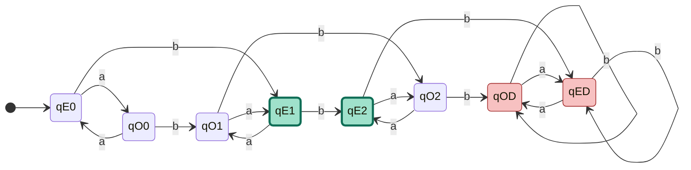
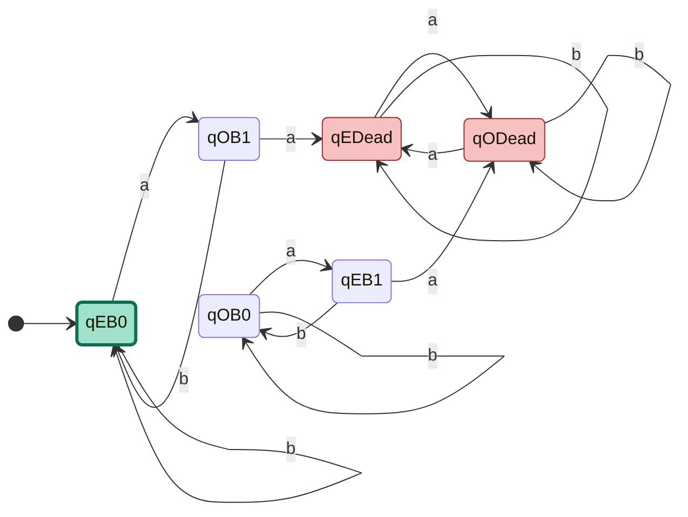
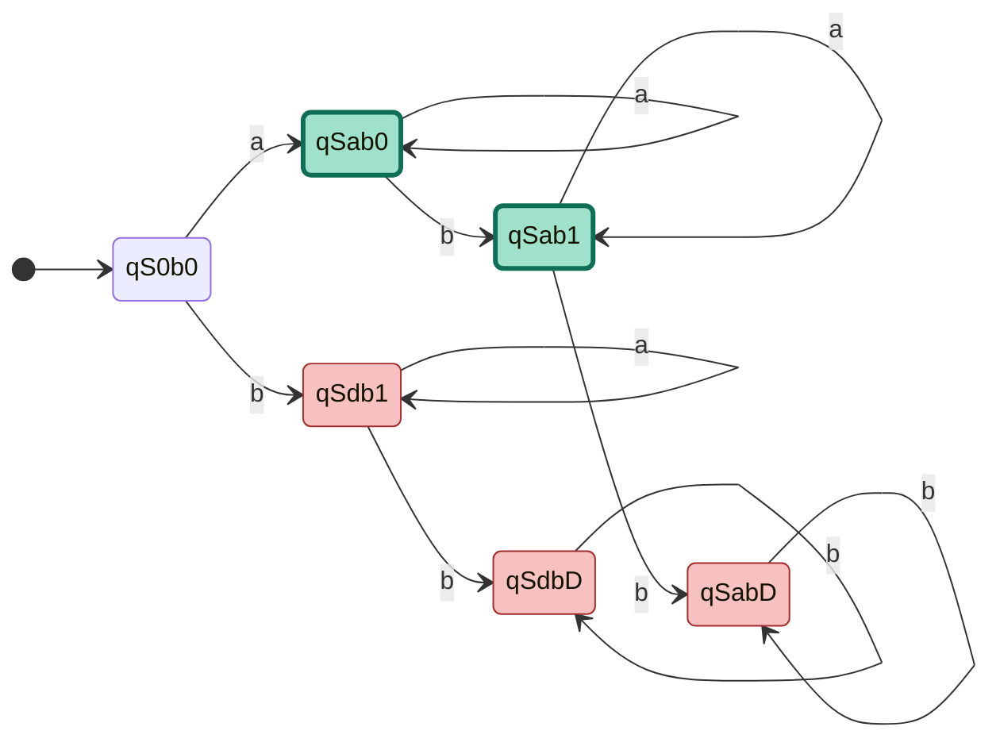
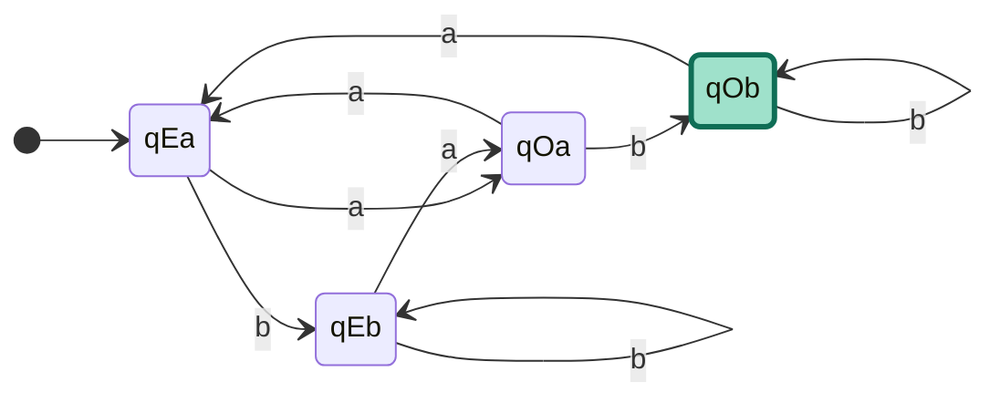
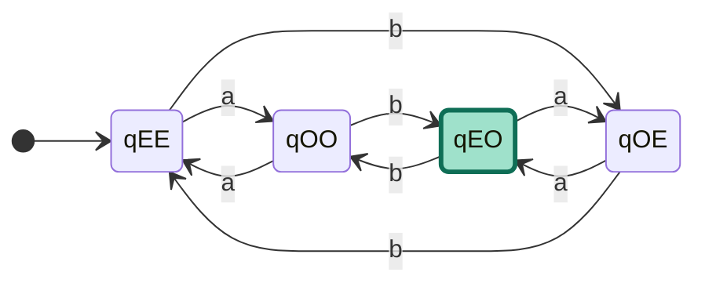

# Sipser《计算理论导引》1.4 题 DFA 状态图(Mermaid 版)

**题目**:下面每个语言都是两个简单语言的交。对每一小题先构造简单语言的 DFA,然后按 1.1.5 节脚注所讨论的构造方法(笛卡尔积构造)结合它们以画出给定语言的 DFA。字母表 $\Sigma = \{a, b\}$。

**构造原理**(摘自脚注):设 $M_1, M_2$ 分别识别 $L_1, L_2$,则识别 $L_1 \cap L_2$ 的 DFA 状态集为 $Q_1 \times Q_2$,转移按分量并行,**接受态为 $F_1 \times F_2$**(两个分量都必须是接受态)。

---

## 小题 a:$\{w \mid w$ 含有至少 3 个 a 和至少 2 个 b$\}$

状态命名:`q<i><j>`,$i$ = a 计数(0–3 饱和),$j$ = b 计数(0–2 饱和)。

**接受态**:`q32`

---

## 小题 b:$\{w \mid w$ 含有正好 2 个 a 和至少 2 个 b$\}$

`qD<j>` 是 a ≥ 3 的死状态行。

**接受态**:`q22`

---

## 小题 c:$\{w \mid w$ 含有偶数个 a 和 1 个或 2 个 b$\}$

状态命名:`q<a 奇偶><b 计数>`。E = 偶,O = 奇,D = b ≥ 3 的死状态。

**接受态**:`qE1`, `qE2`

---

## 小题 d:$\{w \mid w$ 含有偶数个 a 并且每个 a 后都跟有至少一个 b$\}$

状态含义:E/O = a 计数奇偶;B0 = 已读过 b 或空串(允许接受);B1 = 刚读到 a,等待 b;Dead = a 后跟 a 的死状态。

**接受态**:`qEB0`

---

## 小题 e:$\{w \mid w$ 从 a 开始并且最多有 1 个 b$\}$

只画从起始可达的 6 个状态(完整笛卡尔积有 9 个,不可达的 3 个已省略)。

**接受态**:`qSab0`, `qSab1`

---

## 小题 f:$\{w \mid w$ 含有奇数个 a 并且以 b 结束$\}$

状态:`q<a 奇偶><末字符>`。起始态 `qEa` 约定"尚未有末字符"归入 a 类(因为空串不以 b 结尾,不接受)。

**接受态**:`qOb`

---

## 小题 g:$\{w \mid w$ 的长度为偶数并且有奇数个 a$\}$

状态:`q<长度奇偶><a 奇偶>`。任何字符都翻转长度奇偶性,a 额外翻转 a 计数奇偶性。

**接受态**:`qEO`(长度偶,a 奇)

**附注**:由 $|w| = \#_a + \#_b$ 可知此语言等价于 $\{w \mid \#_a$ 和 $\#_b$ 都为奇数$\}$。

---

## 渲染说明

本文件中的 Mermaid 代码可以在以下环境直接渲染:

- [Mermaid Live Editor](https://mermaid.live) 在线预览
- GitHub / GitLab 的 Markdown 文件
- Typora、Obsidian、Notion 等支持 Mermaid 的笔记工具
- VS Code(需安装 Markdown Preview Mermaid Support 扩展)
