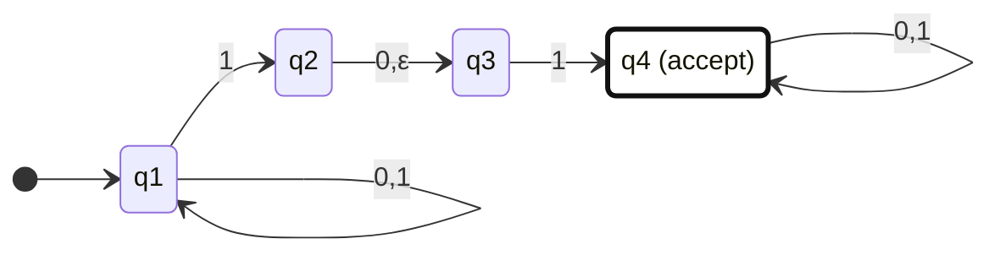
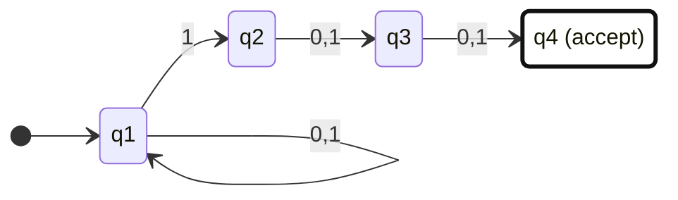
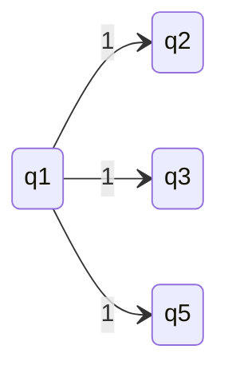
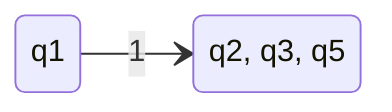

# 证明正则运算的封闭性

- proof $A_{1} \cup A_{2}$

- proof $A_{1} \circ A_{2}$
  - where to split the string? nondeterminism
  - 引入 NFA

## NFA

- 确定性： $\delta (q_{1}, 1) = q_{2}$
- 不确定性：
  - $\delta (q_{1}, 1) = \{q_{2}, \dots \}$  
  - 或允许 $\delta(q_{1}, \epsilon) = {q_{2}}$
  - 对没有定义的跳转 -- reject
  - 只要有一种accept可能性，就accept
  
- example:

- 数学上的定义：

$$
\begin{aligned}
& NFA = (Q, \Sigma, \delta, q_{0}, F) \\
& Q: 状态的集合(有穷) \\
& \Sigma: 字母表 \\
& \delta :  Q \times \Sigma_{\epsilon} \rightarrow  P(Q)  状态转移函数，P(Q)指的是函数的输出是Q的子集 \\
& q_{0} 初始状态\\
& F \subseteq Q 接受状态
\end{aligned}

$$

> 非确定性：有多种假设，guess

- example : 接受 {0,1} 构成的 string，倒数第三个是 1

## NFA 和 DFA 的等价性

- 每一台非确定的NFA等价于某一台DFA

- NFA

- NFA to DFA

- 子集构造法 (hard way)
  - 列出所有子集
  - 确定初始状态
  - 追踪状态的转移
  - 接受状态 -- 所有有接受状态的集合

> NFA to DFA 的代价：状态从 |Q| 到 $2^{|Q|}$
>
> NFA 与 DFA 等价：并行-串行

- NFA能识别的语言是正则语言（Regular Language def）

## 回到封闭性的证明

> NFA 的帮助

> 构造*运算的NFA,不能把原先的初始状态改造成接受状态，原先的初始状态可能会有一些“初始操作”

# 正则语言

> 使用正则运算去定义正则语言  
>
> $\circ$ 相当与乘法
>
> 先星号、再连接、再并

- example: $(0 \cup 1) \circ 0^{*}$

- 正则语言的定义 （递归的形式）
  - 一个字符 是 re
  - $\epsilon$ 是 re
  - $\Phi$ 是 re
  - 正则表达式的运算

- 任何集合与空集连接，得到空集 ?

- $R \cup \Phi = R$
- $R \circ \epsilon =R$

- 一个语言是正则的，当且仅当可以用正则表达式描述它
  - proof：能从正则表达式写出自动机，能从自动机写出正则表达式
    - 正向的，根据正则表达式的定义，一点点拆，然后拼出 NFA
    - 反向的：引入广义有穷非确定自动机
      - 广义有穷非确定自动机
        - 不能有回路，只保留s和t状态，一个状态一个状态的删除
        - 如何“删除”一个状态？状态删除，边串起来

# Summary

- 什么是正则语言？
  1. 能被FA识别的
  2. 能被RE描述的
